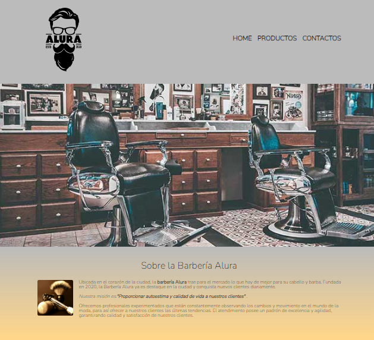

<h1 align="center"> 💈 Pagina Barberia Alura 💈 </h1>

 Pagina web realizada con fines de practica en el curso de Alura latam 

  <a href="#tecnologias" style="color:orange"> Tecnologias </a>&nbsp;&nbsp;&nbsp;|&nbsp;&nbsp;&nbsp;
  <a href="#projecto" style="color:black"> Proyecto </a>&nbsp;&nbsp;&nbsp;|&nbsp;&nbsp;&nbsp;
  <a href="#link" style="color:orange"> Link </a>

## 💈 Tecnologías 

Este proyecto fue realizado con las siguientes tecnologías:

- HTML
- CSS
- Github

## 💈 Proyecto

Este proyecto tiene el objetivo de poner en practica los conocimientos adquiridos en las clases de HTML y CSS brindadas por Alura Latam, en donde se creo una pagina web simulando que va para una barberia con los principales aspectos de una pagina web funcional que sea amigable con el publico.

## 💈 Link

Pueden visualizar la pagina web através [DEL LINK](https://camilavildoso.github.io/Barberia-Alura/).

